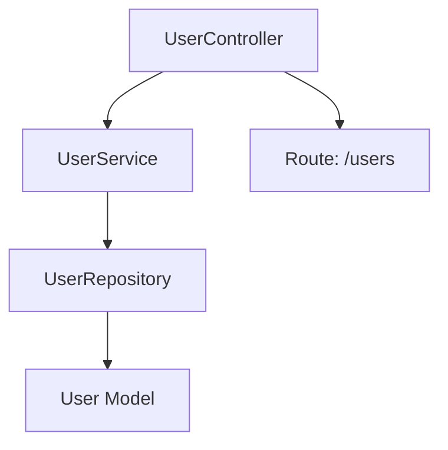

# Laravel Atlas

<div align="center">
  
  <p><strong>Map and visualize your Laravel application's architecture — models, services, routes, jobs, events, and more.</strong></p>

  [](https://packagist.org/packages/grazulex/laravel-atlas)
  [](https://packagist.org/packages/grazulex/laravel-atlas)
  [](LICENSE.md)
  [](https://php.net)
  [](https://laravel.com)
  [](https://github.com/laravel/pint)
</div>

## 🗺️ Overview

Laravel Atlas scans your Laravel project to generate a complete, structured map of its internal components — including models, routes, observers, jobs, events, commands, services, and more — and exports visual or machine-readable representations in formats like **Mermaid**, **Markdown**, **JSON**, or **PDF**.

> A modern developer companion to explore, document, and understand any Laravel codebase.

## ✨ Features

- 🔍 Analyze your Laravel application's structure and dependencies
- 🧩 Discover models, services, jobs, observers, events, routes, and their connections
- 📤 Export maps in Mermaid, Markdown, JSON, and more
- 🧠 Ideal for onboarding, auditing, or maintaining large codebases
- 💡 Extensible architecture — add custom node types or link rules
- 🔧 CLI command: `php artisan atlas:generate`

## 📦 Installation

```bash
composer require grazulex/laravel-atlas --dev
```

## 🚀 Usage

```bash
php artisan atlas:generate --format=mermaid
```

Outputs will be saved in `storage/atlas/` or a custom path defined in `config/atlas.php`.

## 📁 Export Formats

- 🧬 `mermaid` — ideal for embedding in Markdown or docs
- 📚 `markdown` — summary view for developers
- 🧾 `json` — for machine processing or external tools
- 📄 `pdf` (planned) — for shareable architectural overviews

## 🧩 Example



## 🛠️ Configuration

```php
// config/atlas.php
return [
    'export_path' => storage_path('atlas'),
    'formats' => ['mermaid', 'json', 'markdown'],
];
```

## 🤝 Contributing

PRs and ideas are welcome! Feel free to open an issue or start a discussion.

## 📄 License

Laravel Atlas is open-sourced software licensed under the [MIT license](LICENSE.md).