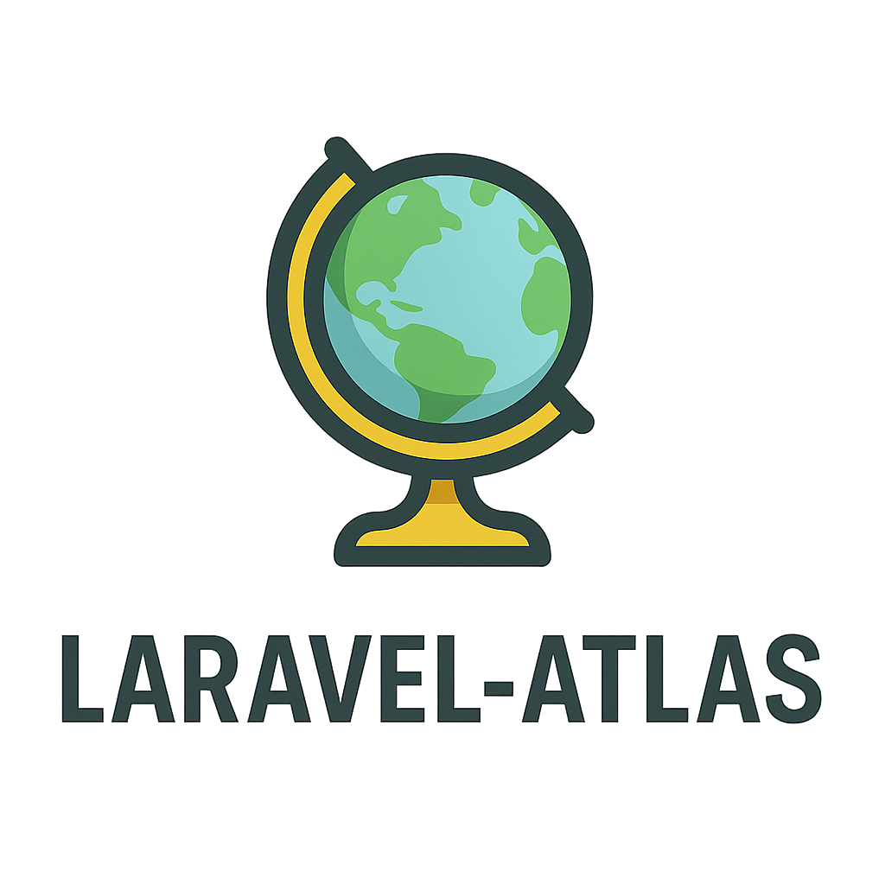

# Laravel Atlas



Advanced Laravel application mapping and visualization toolkit. Analyze, document, and visualize your Laravel project architecture with comprehensive dependency mapping and multiple export formats.

[](https://packagist.org/packages/grazulex/laravel-atlas)
[](https://packagist.org/packages/grazulex/laravel-atlas)
[](https://github.com/Grazulex/laravel-atlas/blob/main/LICENSE.md)
[](https://php.net/)
[](https://laravel.com/)
[](https://github.com/Grazulex/laravel-atlas/actions)
[](https://github.com/laravel/pint)

## 📖 Table of Contents

- [Overview](#overview)
- [✨ Features](#-features)
- [📦 Installation](#-installation)
- [🚀 Quick Start](#-quick-start)
- [🗺️ Architecture Mapping](#️-architecture-mapping)
- [📊 Export Formats](#-export-formats)
- [🔍 Analysis Tools](#-analysis-tools)
- [⚙️ Configuration](#️-configuration)
- [📚 Documentation](#-documentation)
- [💡 Examples](#-examples)
- [🧪 Testing](#-testing)
- [🔧 Requirements](#-requirements)
- [🚀 Performance](#-performance)
- [🤝 Contributing](#-contributing)
- [🔒 Security](#-security)
- [📄 License](#-license)

## Overview

Laravel Atlas is an advanced application mapping and visualization toolkit that scans your Laravel project to generate comprehensive architectural documentation. It analyzes models, services, routes, jobs, events, commands, and their interconnections, then exports visual representations in multiple formats.

**Perfect for code documentation, team onboarding, architecture reviews, and maintaining large enterprise applications.**

### 🎯 Use Cases

Laravel Atlas is perfect for:

- **Code Documentation** - Generate comprehensive application maps
- **Team Onboarding** - Visual architecture overviews for new developers
- **Architecture Reviews** - Analyze application structure and dependencies  
- **Legacy Code Analysis** - Understand complex existing applications
- **Compliance Reporting** - Generate architectural documentation

## ✨ Features

- 🚀 **Comprehensive Scanning** - Analyze 7 Laravel component types
- 🗺️ **Architecture Mapping** - Generate detailed application structure maps
- 📊 **Multiple Export Formats** - Export to JSON, HTML, Markdown, and PHP
- 🔍 **Dependency Analysis** - Track relationships and dependencies between components
- 📋 **Extensible Architecture** - Support for custom mappers and exporters
- 🎯 **Smart Detection** - Intelligent component discovery and classification
- 🧪 **Analysis Reports** - Comprehensive architectural analysis reports
- ⚡ **CLI Integration** - Powerful Artisan commands for map generation
- 💻 **Programmatic API** - Full PHP API with Atlas facade
- 📝 **Documentation Generation** - Auto-generate architecture documentation

## 📦 Installation

Install the package via Composer:

```bash
composer require grazulex/laravel-atlas --dev
```

> **💡 Auto-Discovery**  
> The service provider will be automatically registered thanks to Laravel's package auto-discovery.

Publish configuration:

```bash
php artisan vendor:publish --tag=atlas-config
```

## 🚀 Quick Start

### 1. Generate Your First Map

```bash
php artisan atlas:generate
```

This creates a JSON output showing all discovered components in your application.

### 2. Generate Specific Component Maps

```bash
# Generate model architecture map
php artisan atlas:generate --type=models --format=markdown

# Generate route map
php artisan atlas:generate --type=routes --format=html

# Generate commands map  
php artisan atlas:generate --type=commands --format=json

# Generate services map
php artisan atlas:generate --type=services --format=markdown

# Generate notifications map
php artisan atlas:generate --type=notifications --format=html

# Generate middlewares map
php artisan atlas:generate --type=middlewares --format=json

# Generate form requests map
php artisan atlas:generate --type=form_requests --format=markdown

# Generate complete application map (all available components)
php artisan atlas:generate --type=all --format=json --output=docs/architecture.json
```

### 3. Customize Export Formats

```bash
# Generate JSON output (default)
php artisan atlas:generate --format=json

# Generate comprehensive markdown documentation
php artisan atlas:generate --format=markdown

# Generate interactive HTML map
php artisan atlas:generate --format=html
```

### 4. Access Generated Maps Programmatically

```php
use LaravelAtlas\Facades\Atlas;

// Scan specific component types
$modelData = Atlas::scan('models');
$routeData = Atlas::scan('routes');
$commandData = Atlas::scan('commands');
$serviceData = Atlas::scan('services');
$notificationData = Atlas::scan('notifications');
$middlewareData = Atlas::scan('middlewares');
$formRequestData = Atlas::scan('form_requests');

// Export to different formats
$jsonOutput = Atlas::export('models', 'json');
$markdownDocs = Atlas::export('routes', 'markdown');
$htmlReport = Atlas::export('commands', 'html');
```

## 🗺️ Architecture Mapping

Laravel Atlas provides comprehensive architecture mapping capabilities through specialized mappers:

```php
use LaravelAtlas\Facades\Atlas;

// Model architecture mapping
$modelData = Atlas::scan('models', [
    'include_relationships' => true,
    'include_observers' => true,
    'include_factories' => true,
]);

// Route mapping
$routeData = Atlas::scan('routes', [
    'include_middleware' => true,
    'include_controllers' => true,
    'group_by_prefix' => true,
]);

// Command mapping
$commandData = Atlas::scan('commands', [
    'include_signatures' => true,
    'include_descriptions' => true,
]);

// Service mapping
$serviceData = Atlas::scan('services', [
    'include_dependencies' => true,
    'include_methods' => true,
]);

// Notification mapping
$notificationData = Atlas::scan('notifications', [
    'include_channels' => true,
    'include_flow' => true,
]);

// Middleware mapping
$middlewareData = Atlas::scan('middlewares', [
    'include_parameters' => true,
    'include_dependencies' => true,
]);

// Form Request mapping
$formRequestData = Atlas::scan('form_requests', [
    'include_rules' => true,
    'include_authorization' => true,
]);
```

### Available Component Types

Laravel Atlas can analyze **7 component types**:

- **models** - Eloquent models with relationships, observers, and factories
- **routes** - Application routes with middleware and controllers  
- **commands** - Artisan commands with their signatures and descriptions
- **services** - Application service classes with methods and dependencies
- **notifications** - Laravel notification classes with channels and methods
- **middlewares** - HTTP middleware with parameters and dependencies
- **form_requests** - Form request validation classes with rules and authorization

## 📊 Export Formats

Multiple export formats for different use cases:

```bash
# JSON for data processing and API integration
php artisan atlas:generate --format=json --output=storage/atlas/map.json

# Markdown documentation for README files
php artisan atlas:generate --format=markdown --output=docs/ARCHITECTURE.md

# Interactive HTML maps with full component visualization
php artisan atlas:generate --format=html --output=public/atlas/map.html

# PHP code for advanced processing
php artisan atlas:generate --format=php --output=storage/atlas/map.php
```

### HTML Export Features

The HTML export format provides an **interactive, responsive dashboard** with advanced features:

- **🌓 Dark Mode Support** - Toggle between light and dark themes
- **📱 Responsive Design** - Works on desktop, tablet, and mobile devices
- **🔍 Component Navigation** - Easy sidebar navigation between component types
- **📊 Visual Component Cards** - Rich cards showing detailed component information
- **📈 Real-time Counts** - Live component counts in navigation sidebar
- **🎨 Modern UI** - Built with Tailwind CSS for a professional appearance

**Component Sections Available:**
- 🧱 **Models** - with relationships, attributes, and metadata
- 🛣️ **Routes** - with middleware, controllers, and HTTP methods  
- 💬 **Commands** - with signatures, arguments, and options
- 🔧 **Services** - with methods, dependencies, and flow analysis
- 📢 **Notifications** - with channels, methods, and dependencies
- 🛡️ **Middlewares** - with parameters, dependencies, and flow patterns
- 📋 **Form Requests** - with validation rules, authorization, and attributes

### Programmatic Export

```php
use LaravelAtlas\Facades\Atlas;

// Export specific types to different formats
$jsonOutput = Atlas::export('models', 'json');
$markdownDocs = Atlas::export('routes', 'markdown');
$htmlReport = Atlas::export('commands', 'html');
```

## 🔍 Analysis Tools

Laravel Atlas provides comprehensive component analysis:

```php
use LaravelAtlas\Facades\Atlas;

// Analyze specific component types
$modelAnalysis = Atlas::scan('models', [
    'include_relationships' => true,
    'include_observers' => true
]);

$routeAnalysis = Atlas::scan('routes', [
    'include_middleware' => true,
    'include_controllers' => true
]);

$commandAnalysis = Atlas::scan('commands', [
    'include_signatures' => true,
    'include_descriptions' => true
]);

$serviceAnalysis = Atlas::scan('services', [
    'include_dependencies' => true,
    'include_methods' => true
]);

$notificationAnalysis = Atlas::scan('notifications', [
    'include_channels' => true,
    'include_flow' => true
]);

$middlewareAnalysis = Atlas::scan('middlewares', [
    'include_parameters' => true,
    'include_dependencies' => true
]);

$formRequestAnalysis = Atlas::scan('form_requests', [
    'include_rules' => true,
    'include_authorization' => true,
    'include_attributes' => true
]);

// Generate detailed reports
$allComponents = Atlas::scan('all', ['detailed' => true]);

// Export analysis results
$analysisReport = Atlas::export('all', 'markdown', [
    'include_stats' => true,
    'detailed_sections' => true
]);
```

## ⚙️ Configuration

Laravel Atlas provides extensive configuration options:

```php
// config/atlas.php
return [
    'enabled' => env('ATLAS_ENABLED', true),
    
    'status_tracking' => [
        'enabled' => env('ATLAS_STATUS_TRACKING_ENABLED', true),
        'file_path' => env('ATLAS_STATUS_FILE_PATH', storage_path('logs/atlas_status.log')),
        'track_history' => env('ATLAS_TRACK_HISTORY', true),
        'max_entries' => env('ATLAS_MAX_ENTRIES', 1000),
    ],
    
    'generation' => [
        'output_path' => env('ATLAS_OUTPUT_PATH', base_path('atlas')),
        'formats' => [
            'json' => env('ATLAS_FORMAT_JSON', true),
            'markdown' => env('ATLAS_FORMAT_MARKDOWN', true),
            'html' => env('ATLAS_FORMAT_HTML', true),
        ],
    ],
    
    'analysis' => [
        'include_vendors' => env('ATLAS_INCLUDE_VENDORS', false),
        'max_depth' => env('ATLAS_MAX_DEPTH', 10),
        'scan_paths' => [
            app_path(),
            database_path(),
            config_path(),
        ],
    ],
];
```

## 📚 Documentation

### Core Documentation

- **[Getting Started](#-quick-start)** - Basic usage and installation
- **[Available Components](#available-component-types)** - Currently supported component types
- **[Examples Directory](examples/)** - Working examples for all features
- **[Configuration](#️-configuration)** - Detailed configuration options

### Quick Links

- **[Examples README](examples/README.md)** - Overview of all working examples
- **[Basic Usage Example](examples/basic-usage.php)** - Simple scanning and exporting
- **[Models Analysis](examples/models-example.php)** - Detailed model mapping
- **[Routes Analysis](examples/routes-example.php)** - Route mapping with middleware
- **[Commands Analysis](examples/commands-example.php)** - Artisan command analysis
- **[Services Analysis](examples/services-example.php)** - Service class mapping with dependencies
- **[Notifications Analysis](examples/notifications-example.php)** - Notification mapping with channels
- **[Middlewares Analysis](examples/middlewares-example.php)** - Middleware analysis with parameters
- **[Form Requests Analysis](examples/form-requests-example.php)** - Form request validation mapping
- **[Complete Analysis](examples/complete-analysis.php)** - Full application documentation

## 💡 Examples

### Generate Complete Application Map

```bash
# Generate comprehensive application architecture
php artisan atlas:generate --type=all --format=html --output=docs/architecture.html

# Generate specific component maps
php artisan atlas:generate --type=models --format=markdown --output=docs/models.md
php artisan atlas:generate --type=routes --format=json --output=docs/routes.json
php artisan atlas:generate --type=commands --format=html --output=docs/commands.html
php artisan atlas:generate --type=services --format=markdown --output=docs/services.md
php artisan atlas:generate --type=notifications --format=html --output=docs/notifications.html
php artisan atlas:generate --type=middlewares --format=json --output=docs/middlewares.json
php artisan atlas:generate --type=form_requests --format=markdown --output=docs/form-requests.md
```

### Custom Architecture Analysis

```php
use LaravelAtlas\Facades\Atlas;

// Custom analysis workflow
$modelData = Atlas::scan('models', ['include_relationships' => true]);
$routeData = Atlas::scan('routes', ['include_middleware' => true]);
$commandData = Atlas::scan('commands', ['include_signatures' => true]);
$serviceData = Atlas::scan('services', ['include_dependencies' => true]);
$notificationData = Atlas::scan('notifications', ['include_channels' => true]);
$middlewareData = Atlas::scan('middlewares', ['include_parameters' => true]);
$formRequestData = Atlas::scan('form_requests', ['include_rules' => true]);

$markdownReport = Atlas::export('models', 'markdown', [
    'include_stats' => true,
    'detailed_sections' => true,
]);

file_put_contents('docs/architecture-analysis.md', $markdownReport);
```

### Interactive Architecture Explorer

```php
// Generate comprehensive HTML documentation
$htmlOutput = Atlas::export('all', 'html');
file_put_contents('public/atlas/explorer.html', $htmlOutput);
```

### CI/CD Integration

```bash
# In your CI/CD pipeline
php artisan atlas:generate --type=all --format=json --output=docs/architecture.json
php artisan atlas:generate --type=all --format=markdown --output=docs/ARCHITECTURE.md
php artisan atlas:generate --type=all --format=html --output=public/docs/architecture.html

# Generate specific component documentation
php artisan atlas:generate --type=models --format=markdown --output=docs/models.md
php artisan atlas:generate --type=routes --format=json --output=api/routes.json
php artisan atlas:generate --type=commands --format=html --output=docs/commands.html
php artisan atlas:generate --type=services --format=markdown --output=docs/services.md
php artisan atlas:generate --type=notifications --format=html --output=docs/notifications.html
php artisan atlas:generate --type=middlewares --format=json --output=docs/middlewares.json
php artisan atlas:generate --type=form_requests --format=markdown --output=docs/form-requests.md
```

### Advanced Export Examples

```php
use LaravelAtlas\Facades\Atlas;

// Generate comprehensive HTML documentation for available components
$htmlReport = Atlas::export('all', 'html');
file_put_contents('reports/architecture-review.html', $htmlReport);

// Export raw PHP data for custom processing
$phpData = Atlas::export('models', 'php');
file_put_contents('storage/atlas/models-data.php', $phpData);

// Generate JSON reports for API consumption
$jsonData = Atlas::export('routes', 'json');
file_put_contents('public/api/routes.json', $jsonData);

// Generate interactive HTML reports for specific components
$servicesHtml = Atlas::export('services', 'html');
file_put_contents('public/docs/services.html', $servicesHtml);

$notificationsHtml = Atlas::export('notifications', 'html');
file_put_contents('public/docs/notifications.html', $notificationsHtml);
```

Check out the [examples directory](examples/) for working examples of all current features.

## 🧪 Testing

Laravel Atlas includes testing utilities and can be tested in your application:

```php
use Tests\TestCase;
use LaravelAtlas\Facades\Atlas;

class ArchitectureTest extends TestCase
{
    public function test_models_can_be_scanned(): void
    {
        $data = Atlas::scan('models');
        
        $this->assertIsArray($data);
        $this->assertArrayHasKey('type', $data);
        $this->assertEquals('models', $data['type']);
        $this->assertArrayHasKey('data', $data);
    }

    public function test_routes_can_be_scanned(): void
    {
        $data = Atlas::scan('routes');
        
        $this->assertIsArray($data);
        $this->assertArrayHasKey('type', $data);
        $this->assertEquals('routes', $data['type']);
        $this->assertArrayHasKey('data', $data);
    }

    public function test_commands_can_be_scanned(): void
    {
        $data = Atlas::scan('commands');
        
        $this->assertIsArray($data);
        $this->assertArrayHasKey('type', $data);
        $this->assertEquals('commands', $data['type']);
        $this->assertArrayHasKey('data', $data);
    }

    public function test_services_can_be_scanned(): void
    {
        $data = Atlas::scan('services');
        
        $this->assertIsArray($data);
        $this->assertArrayHasKey('type', $data);
        $this->assertEquals('services', $data['type']);
        $this->assertArrayHasKey('data', $data);
    }

    public function test_notifications_can_be_scanned(): void
    {
        $data = Atlas::scan('notifications');
        
        $this->assertIsArray($data);
        $this->assertArrayHasKey('type', $data);
        $this->assertEquals('notifications', $data['type']);
        $this->assertArrayHasKey('data', $data);
    }

    public function test_middlewares_can_be_scanned(): void
    {
        $data = Atlas::scan('middlewares');
        
        $this->assertIsArray($data);
        $this->assertArrayHasKey('type', $data);
        $this->assertEquals('middlewares', $data['type']);
        $this->assertArrayHasKey('data', $data);
    }

    public function test_form_requests_can_be_scanned(): void
    {
        $data = Atlas::scan('form_requests');
        
        $this->assertIsArray($data);
        $this->assertArrayHasKey('type', $data);
        $this->assertEquals('form_requests', $data['type']);
        $this->assertArrayHasKey('data', $data);
    }

    public function test_json_export_is_valid(): void
    {
        $json = Atlas::export('models', 'json');
        
        $decoded = json_decode($json, true);
        $this->assertIsArray($decoded);
    }

    public function test_all_components_can_be_scanned(): void
    {
        $data = Atlas::scan('all');
        
        $this->assertIsArray($data);
        // Should contain the 7 implemented component types
        $this->assertArrayHasKey('models', $data);
        $this->assertArrayHasKey('routes', $data);
        $this->assertArrayHasKey('commands', $data);
        $this->assertArrayHasKey('services', $data);
        $this->assertArrayHasKey('notifications', $data);
        $this->assertArrayHasKey('middlewares', $data);
        $this->assertArrayHasKey('form_requests', $data);
    }
}
```

## 🔧 Requirements

- PHP: ^8.3
- Laravel: ^12.0
- Carbon: ^3.10

## 🚀 Performance

Laravel Atlas is optimized for performance:

- **Efficient Scanning**: Optimized file system scanning and parsing
- **Smart Caching**: Intelligent caching of analysis results
- **Memory Management**: Efficient memory usage for large applications
- **Incremental Updates**: Only scan changed files when possible

## 🤝 Contributing

We welcome contributions! Please see our [Contributing Guide](CONTRIBUTING.md) for details.

## 🔒 Security

If you discover a security vulnerability, please review our [Security Policy](SECURITY.md) before disclosing it.

## 📄 License

Laravel Atlas is open-sourced software licensed under the [MIT license](LICENSE.md).

---

**Made with ❤️ for the Laravel community**

### Resources

- [📖 Documentation](docs/README.md)
- [💬 Discussions](https://github.com/Grazulex/laravel-atlas/discussions)
- [🐛 Issue Tracker](https://github.com/Grazulex/laravel-atlas/issues)
- [📦 Packagist](https://packagist.org/packages/grazulex/laravel-atlas)

### Community Links

- [CODE_OF_CONDUCT.md](CODE_OF_CONDUCT.md) - Our code of conduct
- [CONTRIBUTING.md](CONTRIBUTING.md) - How to contribute
- [SECURITY.md](SECURITY.md) - Security policy
- [RELEASES.md](RELEASES.md) - Release notes and changelog
