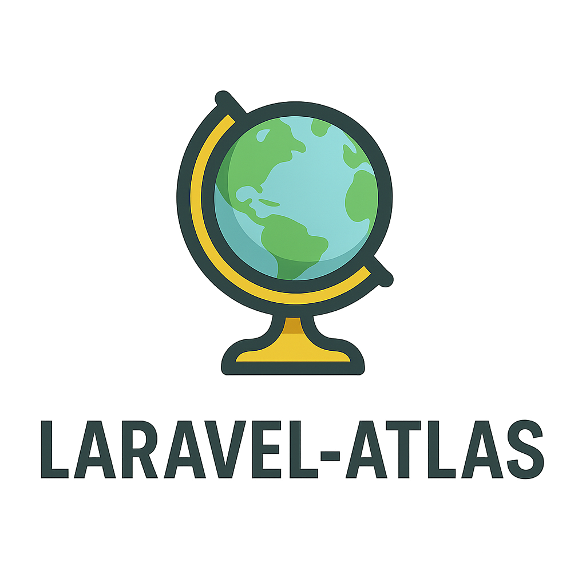

# Laravel Atlas



Advanced Laravel application mapping and visualization toolkit. Analyze, document, and visualize your Laravel project architecture with comprehensive dependency mapping and multiple export formats.

[](https://packagist.org/packages/grazulex/laravel-atlas)
[](https://packagist.org/packages/grazulex/laravel-atlas)
[](https://github.com/Grazulex/laravel-atlas/blob/main/LICENSE.md)
[](https://php.net/)
[](https://laravel.com/)
[](https://github.com/Grazulex/laravel-atlas/actions)
[](https://github.com/laravel/pint)

## 📖 Table of Contents

- [Overview](#overview)
- [✨ Features](#-features)
- [📦 Installation](#-installation)
- [🚀 Quick Start](#-quick-start)
- [🗺️ Architecture Mapping](#️-architecture-mapping)
- [📊 Export Formats](#-export-formats)
- [🔍 Analysis Tools](#-analysis-tools)
- [⚙️ Configuration](#️-configuration)
- [📚 Documentation & Wiki](#-documentation)
- [💡 Examples](#-examples)
- [🧪 Testing](#-testing)
- [🔧 Requirements](#-requirements)
- [🚀 Performance](#-performance)
- [🤝 Contributing](#-contributing)
- [🔒 Security](#-security)
- [📄 License](#-license)

## Overview

Laravel Atlas is an advanced application mapping and visualization toolkit that scans your Laravel project to generate comprehensive architectural documentation. It analyzes models, services, routes, jobs, events, commands, and their interconnections, then exports visual representations in multiple formats.

**Perfect for code documentation, team onboarding, architecture reviews, and maintaining large enterprise applications.**

### 🎯 Use Cases

Laravel Atlas is perfect for:

- **Code Documentation** - Generate comprehensive application maps
- **Team Onboarding** - Visual architecture overviews for new developers
- **Architecture Reviews** - Analyze application structure and dependencies  
- **Legacy Code Analysis** - Understand complex existing applications
- **Compliance Reporting** - Generate architectural documentation
- **🧪 Architecture Testing** - Validate application structure and enforce coding standards
- **CI/CD Integration** - Automated architecture analysis and reporting

## ✨ Features

- 🚀 **Comprehensive Scanning** - Analyze 16 Laravel component types
- 🗺️ **Architecture Mapping** - Generate detailed application structure maps
- 📊 **Multiple Export Formats** - Export to JSON, Markdown, HTML, Blade and PDF
- 🔍 **Dependency Analysis** - Track relationships and dependencies between components
- 📋 **Extensible Architecture** - Support for custom mappers and exporters
- 🎯 **Smart Detection** - Intelligent component discovery and classification
- 🧪 **Analysis Reports** - Comprehensive architectural analysis reports
- ⚡ **CLI Integration** - Powerful Artisan commands for map generation
- 💻 **Programmatic API** - Full PHP API with Atlas facade
- 📝 **Documentation Generation** - Auto-generate architecture documentation
- 🧪 **Testing Integration** - Use Atlas facade for architecture testing and validation

## 📦 Installation

Install the package via Composer:

```bash
composer require grazulex/laravel-atlas --dev
```

> **💡 Auto-Discovery**  
> The service provider will be automatically registered thanks to Laravel's package auto-discovery.

Publish configuration:

```bash
php artisan vendor:publish --tag=atlas-config
```

## 🚀 Quick Start

### 1. Generate Your First Map

```bash
php artisan atlas:export
```

This creates an HTML output showing all discovered components in your application.

### 2. Generate Specific Component Maps

```bash
# Generate model architecture map
php artisan atlas:export --type=models --format=html

# Generate route map
php artisan atlas:export --type=routes --format=json

# Generate commands map  
php artisan atlas:export --type=commands --format=pdf

# Generate services map
php artisan atlas:export --type=services --format=html

# Generate notifications map
php artisan atlas:export --type=notifications --format=json

# Generate middlewares map
php artisan atlas:export --type=middlewares --format=pdf

# Generate form requests map
php artisan atlas:export --type=form_requests --format=blade

# Generate events map
php artisan atlas:export --type=events --format=json

# Generate controllers map
php artisan atlas:export --type=controllers --format=html

# Generate jobs map
php artisan atlas:export --type=jobs --format=pdf

# Generate complete application map (all available components)
php artisan atlas:export --type=all --format=html --output=docs/architecture.html
```

### 3. Customize Export Formats

```bash
# Generate JSON output (default)
php artisan atlas:export --format=json

# Generate interactive HTML map
php artisan atlas:export --format=html

# Generate Markdown documentation
php artisan atlas:export --format=markdown

# Generate PDF documentation
php artisan atlas:export --format=pdf

# Generate Blade documentation
php artisan atlas:export --format=blade
```

### 4. Access Generated Maps Programmatically

```php
use LaravelAtlas\Facades\Atlas;

// Scan specific component types - all 16 available types
$modelData = Atlas::scan('models');
$routeData = Atlas::scan('routes');
$commandData = Atlas::scan('commands');
$serviceData = Atlas::scan('services');
$notificationData = Atlas::scan('notifications');
$middlewareData = Atlas::scan('middlewares');
$formRequestData = Atlas::scan('form_requests');
$eventData = Atlas::scan('events');
$controllerData = Atlas::scan('controllers');
$resourceData = Atlas::scan('resources');
$jobData = Atlas::scan('jobs');
$actionData = Atlas::scan('actions');
$policyData = Atlas::scan('policies');
$ruleData = Atlas::scan('rules');
$listenerData = Atlas::scan('listeners');
$observerData = Atlas::scan('observers');

// Export to different formats
$jsonOutput = Atlas::export('models', 'json');
$markdownDoc = Atlas::export('models', 'markdown');
$htmlReport = Atlas::export('routes', 'html');
$htmlReport = Atlas::export('events', 'blade');
$pdfDocument = Atlas::export('commands', 'pdf');
```

## 🗺️ Architecture Mapping

Laravel Atlas provides comprehensive architecture mapping capabilities through specialized mappers:

```php
use LaravelAtlas\Facades\Atlas;

// Model architecture mapping
$modelData = Atlas::scan('models', [
    'include_relationships' => true,
    'include_observers' => true,
    'include_factories' => true,
]);

// Route mapping
$routeData = Atlas::scan('routes', [
    'include_middleware' => true,
    'include_controllers' => true,
    'group_by_prefix' => true,
]);

// Command mapping
$commandData = Atlas::scan('commands', [
    'include_signatures' => true,
    'include_descriptions' => true,
]);

// Service mapping
$serviceData = Atlas::scan('services', [
    'include_dependencies' => true,
    'include_methods' => true,
]);

// Notification mapping
$notificationData = Atlas::scan('notifications', [
    'include_channels' => true,
    'include_flow' => true,
]);

// Middleware mapping
$middlewareData = Atlas::scan('middlewares', [
    'include_parameters' => true,
    'include_dependencies' => true,
]);

// Form Request mapping
$formRequestData = Atlas::scan('form_requests', [
    'include_rules' => true,
    'include_authorization' => true,
]);

// Event mapping
$eventData = Atlas::scan('events', [
    'include_listeners' => true,
    'include_properties' => true,
]);

// Controller mapping
$controllerData = Atlas::scan('controllers', [
    'include_actions' => true,
    'include_dependencies' => true,
]);

// Job mapping
$jobData = Atlas::scan('jobs', [
    'include_methods' => true,
    'include_properties' => true,
    'include_trait_methods' => false, // drop Dispatchable/Queueable/... methods
]);

// Additional component mappings for other types
$resourceData = Atlas::scan('resources');
$actionData = Atlas::scan('actions');
$policyData = Atlas::scan('policies');
$ruleData = Atlas::scan('rules');
$listenerData = Atlas::scan('listeners');
$observerData = Atlas::scan('observers');
```

### Scan Options

Every mapper accepts `paths` and `recursive`, plus the `include_*` options listed
below. **All `include_*` options default to `true`**, so scanning without options
returns the complete component description; passing `false` removes the matching
keys from the scanned data.

| Type | Options | Keys they control |
| --- | --- | --- |
| `models` | `include_relationships`, `include_observers`, `include_factories` | `relations`, `observers`, `factories` |
| `routes` | `include_middleware`, `include_controllers`, `group_by_prefix` | `middleware`, `controller` + `uses`, top-level `grouping` |
| `commands` | `include_signatures`, `include_descriptions` | `signature` + `parsed_signature`, `description` |
| `services` | `include_methods`, `include_dependencies` | `methods`, `dependencies` |
| `notifications` | `include_channels`, `include_flow` | `channels`, `flow` |
| `middlewares` | `include_parameters`, `include_dependencies` | `parameters`, `dependencies` |
| `form_requests` | `include_rules`, `include_authorization`, `include_attributes` | `rules`, `authorization`, `attributes` |
| `events` | `include_listeners`, `include_properties` | `listeners`, `properties` |
| `controllers` | `include_actions`, `include_dependencies` | `methods`, `dependencies` |
| `jobs` | `include_methods`, `include_properties`, `include_trait_methods` | `methods`, `properties`, trait-inherited entries inside `methods` |

`include_trait_methods => false` is the way to keep a job's `methods` limited to
what the job itself declares, instead of the ~40 methods inherited from
`Dispatchable`, `InteractsWithQueue`, `Queueable` and `SerializesModels`.

Model observers are read from the model's registered event listeners, so both
`Model::observe()` and the `#[ObservedBy]` attribute are reported. Factories are
reported as `['uses_factory' => bool, 'class' => ?string, 'exists' => bool]`.

### Available Component Types

Laravel Atlas can analyze **16 component types**:

- **models** - Eloquent models with relationships, observers, and factories
- **routes** - Application routes with middleware and controllers  
- **commands** - Artisan commands with their signatures and descriptions
- **services** - Application service classes with methods and dependencies
- **notifications** - Laravel notification classes with channels and methods
- **middlewares** - HTTP middleware with parameters and dependencies
- **form_requests** - Form request validation classes with rules and authorization
- **events** - Laravel event classes with their properties and methods
- **controllers** - Application controllers with their actions and dependencies
- **resources** - API resource classes with their transformations
- **jobs** - Queue job classes with their handles and dependencies
- **actions** - Single action controllers and action classes
- **policies** - Authorization policy classes with their methods
- **rules** - Custom validation rule classes
- **listeners** - Event listener classes with their handlers
- **observers** - Model observer classes with their lifecycle hooks

## 📊 Export Formats

Multiple export formats for different use cases:

```bash
# JSON for data processing and API integration
php artisan atlas:export --format=json --output=storage/atlas/map.json

# Markdown for READMEs, wikis and code review
php artisan atlas:export --format=markdown --output=docs/atlas/map.md

# Interactive HTML maps with full component visualization
php artisan atlas:export --format=html --output=public/atlas/map.html

# PDF reports for documentation and presentations  
php artisan atlas:export --format=pdf --output=storage/atlas/architecture.pdf

# Blade for adding it to the project, and protect it with your own controller
php artisan atlas:export --format=blade --output=resources/views/atlas/export.blade.php
```

### HTML and Blade Export Features

The HTML/Blade export format provides an **interactive, responsive dashboard** with advanced features:

- **🌓 Dark Mode Support** - Toggle between light and dark themes with persistent preference
- **📱 Responsive Design** - Seamlessly works on desktop, tablet, and mobile devices
- **🔍 Component Navigation** - Easy sidebar navigation between component types with live counts
- **📊 Visual Component Cards** - Rich cards showing detailed component information with syntax highlighting
- **📈 Real-time Counts** - Live component counts displayed in the navigation sidebar
- **🎨 Modern UI** - Built with Tailwind CSS for a professional, enterprise-ready appearance
- **💻 Self-contained** - Complete HTML files with no external dependencies required

**Component Sections Available:**
- 🧱 **Models** - with relationships, attributes, and metadata
- 🛣️ **Routes** - with middleware, controllers, and HTTP methods  
- 💬 **Commands** - with signatures, arguments, and options
- 🔧 **Services** - with methods, dependencies, and flow analysis
- 📢 **Notifications** - with channels, methods, and dependencies
- 🛡️ **Middlewares** - with parameters, dependencies, and flow patterns
- 📋 **Form Requests** - with validation rules, authorization, and attributes
- ⚡ **Events** - with listeners, properties, and event flow
- 🎮 **Controllers** - with actions, dependencies, and request handling
- 🔄 **Resources** - with transformations, attributes, and API structure
- ⚙️ **Jobs** - with handlers, dependencies, and queue configuration
- 🎯 **Actions** - with single responsibilities and method signatures
- 🔐 **Policies** - with authorization methods and access control
- ✅ **Rules** - with validation logic and custom rule implementations
- 👂 **Listeners** - with event handling and processing logic
- 👁️ **Observers** - with model lifecycle hooks and event handling

**Example HTML Generation:**
```bash
# Generate interactive HTML dashboard
php artisan atlas:export --format=html --output=public/docs/architecture.html

# Generate component-specific HTML reports
php artisan atlas:export --type=models --format=html --output=public/docs/models.html
php artisan atlas:export --type=routes --format=html --output=public/docs/routes.html
php artisan atlas:export --type=events --format=html --output=public/docs/events.html
php artisan atlas:export --type=controllers --format=html --output=public/docs/controllers.html
```

**Example Blade Generation:**
```bash
# Generate interactive HTML dashboard
php artisan atlas:export --format=blade --output=resources/views/docs/architecture.html

# Generate component-specific HTML reports
php artisan atlas:export --type=models --format=blade --output=resources/views/docs/models.html
php artisan atlas:export --type=routes --format=blade --output=resources/views/docs/routes.html
php artisan atlas:export --type=events --format=blade --output=resources/views/docs/events.html
php artisan atlas:export --type=controllers --format=blade --output=resources/views/docs/controllers.html
```

**Sample HTML/Blade Dashboard Features:**
- Professional header with project information and dark mode toggle
- Sidebar navigation with component counts (e.g., "🧱 Models [3]", "🛣️ Routes [15]")
- Interactive component cards with collapsible sections
- Syntax-highlighted code examples and relationship mappings
- Responsive grid layouts that adapt to screen size
- Enterprise-ready styling suitable for documentation and presentations

📖 **[See HTML Export Examples in Wiki](https://github.com/Grazulex/laravel-atlas/wiki/HTML-Dashboard)** for complete sample reports and detailed documentation.

### PDF Export Features

The PDF export format provides **professional documentation** suitable for presentations and reports:

- **📄 Professional Layout** - Clean, enterprise-ready document formatting
- **📊 Comprehensive Coverage** - All 16 component types in structured sections
- **🎨 Optimized for Print** - A4 format with proper page breaks and typography
- **📝 Complete Documentation** - Detailed component information with metadata
- **🔧 Self-contained** - Complete PDF files ready for sharing and archiving

**PDF Generation Examples:**
```bash
# Generate complete PDF architecture documentation
php artisan atlas:export --format=pdf --output=docs/architecture.pdf

# Generate component-specific PDF reports
php artisan atlas:export --type=models --format=pdf --output=docs/models.pdf
php artisan atlas:export --type=routes --format=pdf --output=docs/routes.pdf
php artisan atlas:export --type=services --format=pdf --output=docs/services.pdf
```

**PDF Features:**
- Professional header with project information and generation timestamp
- Structured sections for each component type with detailed information
- Optimized typography and layout for readability
- Component metadata including relationships, dependencies, and configurations
- Suitable for documentation packages, compliance reports, and team presentations

**Requirements for PDF Export:**
- `dompdf/dompdf` package (automatically included as suggested dependency)
- `ext-gd` PHP extension for image processing

### Programmatic Export

```php
use LaravelAtlas\Facades\Atlas;

// Export specific types to different formats
$jsonOutput = Atlas::export('models', 'json');
$markdownDoc = Atlas::export('models', 'markdown');
$htmlReport = Atlas::export('routes', 'html');
$htmlReport = Atlas::export('events', 'blade');
$pdfDocument = Atlas::export('commands', 'pdf');
```

#### Markdown export options

The Markdown exporter accepts two options:

| Option | Default | Effect |
| --- | --- | --- |
| `include_stats` | `true` | Prepend a summary table with a row per component type |
| `detailed_sections` | `true` | Render every component with its full detail; set to `false` for a plain list of class names |

```php
$analysisReport = Atlas::export('all', 'markdown', [
    'include_stats' => true,
    'detailed_sections' => true,
]);
```

## 🧪 Testing Your Architecture

Laravel Atlas provides powerful capabilities for **testing and validating your application's architecture**. Use the Atlas facade in your tests to ensure your codebase follows intended patterns and standards.

### Architecture Testing Examples

```php
use Tests\TestCase;
use LaravelAtlas\Facades\Atlas;

class ArchitectureTest extends TestCase
{
    /** @test */
    public function controllers_follow_naming_conventions(): void
    {
        $controllersData = Atlas::scan('controllers');
        
        foreach ($controllersData['data'] as $controller) {
            $this->assertStringEndsWith('Controller', $controller['name']);
        }
    }

    /** @test */
    public function models_have_proper_relationships(): void
    {
        $modelsData = Atlas::scan('models', ['include_relationships' => true]);
        
        foreach ($modelsData['data'] as $model) {
            $relationshipCount = count($model['relationships'] ?? []);
            $this->assertLessThan(15, $relationshipCount, 
                "Model {$model['name']} has too many relationships");
        }
    }

    /** @test */
    public function routes_have_proper_middleware(): void
    {
        $routesData = Atlas::scan('routes', ['include_middleware' => true]);
        
        $apiRoutes = array_filter($routesData['data'], 
            fn($route) => str_starts_with($route['uri'], 'api/'));
            
        foreach ($apiRoutes as $route) {
            $this->assertContains('api', $route['middleware']);
        }
    }
}
```

### CI/CD Integration

```bash
# Run architecture tests in your pipeline
php artisan test --filter=ArchitectureTest

# Generate architecture reports
php artisan atlas:export --format=html --output=reports/architecture.html
php artisan atlas:export --format=json --output=reports/architecture.json
```

📖 **[Learn More: Testing Architecture Guide](https://github.com/Grazulex/laravel-atlas/wiki/Architecture-Testing)** for advanced testing strategies and examples.

## 🔍 Analysis Tools

Laravel Atlas provides comprehensive component analysis:

```php
use LaravelAtlas\Facades\Atlas;

// Analyze specific component types
$modelAnalysis = Atlas::scan('models', [
    'include_relationships' => true,
    'include_observers' => true
]);

$routeAnalysis = Atlas::scan('routes', [
    'include_middleware' => true,
    'include_controllers' => true
]);

$commandAnalysis = Atlas::scan('commands', [
    'include_signatures' => true,
    'include_descriptions' => true
]);

$serviceAnalysis = Atlas::scan('services', [
    'include_dependencies' => true,
    'include_methods' => true
]);

$notificationAnalysis = Atlas::scan('notifications', [
    'include_channels' => true,
    'include_flow' => true
]);

$middlewareAnalysis = Atlas::scan('middlewares', [
    'include_parameters' => true,
    'include_dependencies' => true
]);

$formRequestAnalysis = Atlas::scan('form_requests', [
    'include_rules' => true,
    'include_authorization' => true,
    'include_attributes' => true
]);

// Generate detailed reports
$allComponents = Atlas::scan('all', ['detailed' => true]);

// Export analysis results
$analysisReport = Atlas::export('all', 'markdown', [
    'include_stats' => true,
    'detailed_sections' => true
]);
```

## ⚙️ Configuration

Laravel Atlas provides extensive configuration options:

```php
// config/atlas.php
return [
    'enabled' => env('ATLAS_ENABLED', true),
    
    'status_tracking' => [
        'enabled' => env('ATLAS_STATUS_TRACKING_ENABLED', true),
        'file_path' => env('ATLAS_STATUS_FILE_PATH', storage_path('logs/atlas_status.log')),
        'track_history' => env('ATLAS_TRACK_HISTORY', true),
        'max_entries' => env('ATLAS_MAX_ENTRIES', 1000),
    ],
    
    'generation' => [
        'output_path' => env('ATLAS_OUTPUT_PATH', base_path('atlas')),
        'formats' => [
            'json' => env('ATLAS_FORMAT_JSON', true),
            'markdown' => env('ATLAS_FORMAT_MARKDOWN', true),
            'html' => env('ATLAS_FORMAT_HTML', true),
            'blade' => env('ATLAS_FORMAT_BLADE', true),
        ],
    ],
    
    'analysis' => [
        'include_vendors' => env('ATLAS_INCLUDE_VENDORS', false),
        'max_depth' => env('ATLAS_MAX_DEPTH', 10),
        'scan_paths' => [
            app_path(),
            database_path(),
            config_path(),
        ],
    ],
];
```

## 📚 Documentation & Wiki

📖 **[Complete Documentation & Examples - Laravel Atlas Wiki](https://github.com/Grazulex/laravel-atlas/wiki)**

All documentation, examples, and advanced usage guides have been moved to our comprehensive Wiki:

### 🚀 Quick Links

- **[📖 Home](https://github.com/Grazulex/laravel-atlas/wiki)** - Wiki homepage with navigation
- **[🎯 Getting Started](https://github.com/Grazulex/laravel-atlas/wiki/Getting-Started)** - Installation and basic usage
- **[🗺️ Component Types](https://github.com/Grazulex/laravel-atlas/wiki/Component-Types)** - All 16 supported component types
- **[📊 Export Formats](https://github.com/Grazulex/laravel-atlas/wiki/Export-Formats)** - HTML, JSON, Blade and PDF export details
- **[🧪 Architecture Testing](https://github.com/Grazulex/laravel-atlas/wiki/Architecture-Testing)** - Testing and validation guide
- **[⚙️ Configuration](https://github.com/Grazulex/laravel-atlas/wiki/Configuration)** - Complete configuration options
- **[🔧 Advanced Usage](https://github.com/Grazulex/laravel-atlas/wiki/Advanced-Usage)** - Power user features
- **[🎨 HTML/Blade Dashboard](https://github.com/Grazulex/laravel-atlas/wiki/HTML-Dashboard)** - Interactive HTML/Blade export features

### 💡 Working Examples

- **[💻 Code Examples](https://github.com/Grazulex/laravel-atlas/wiki/Code-Examples)** - PHP code samples
- **[📋 Command Examples](https://github.com/Grazulex/laravel-atlas/wiki/Command-Examples)** - Artisan command usage
- **[🏗️ CI/CD Integration](https://github.com/Grazulex/laravel-atlas/wiki/CI-CD-Integration)** - Pipeline integration examples
- **[📱 Live Demos](https://github.com/Grazulex/laravel-atlas/wiki/Live-Demos)** - Interactive demo reports

## 💡 Examples

📚 **[All Examples Available in Wiki](https://github.com/Grazulex/laravel-atlas/wiki/Examples)**

### Quick Start Examples

```bash
# Generate complete application map
php artisan atlas:export --type=all --format=html

# Generate specific component maps
php artisan atlas:export --type=models --format=json
php artisan atlas:export --type=routes --format=html
php artisan atlas:export --type=events --format=blade
php artisan atlas:export --type=services --format=pdf
```

### Basic PHP Usage

```php
use LaravelAtlas\Facades\Atlas;

// Scan specific components
$models = Atlas::scan('models');
$routes = Atlas::scan('routes');

// Export to different formats
$html = Atlas::export('all', 'html');
$html = Atlas::export('events', 'blade');
$json = Atlas::export('models', 'json');
```

📖 **[Complete Examples, Tutorials & Advanced Usage →](https://github.com/Grazulex/laravel-atlas/wiki)**
php artisan atlas:export --type=controllers --format=html --output=docs/controllers.html
```

### Advanced Export Examples

```php
use LaravelAtlas\Facades\Atlas;

// Generate comprehensive HTML documentation for available components
$htmlReport = Atlas::export('all', 'html');
file_put_contents('reports/architecture-review.html', $htmlReport);

// Generate PDF reports for presentations
$pdfReport = Atlas::export('all', 'pdf');
file_put_contents('reports/architecture-presentation.pdf', $pdfReport);

// Generate JSON reports for API consumption
$jsonData = Atlas::export('routes', 'json');
file_put_contents('public/api/routes.json', $jsonData);

// Generate interactive HTML reports for specific components
$servicesHtml = Atlas::export('services', 'html');
file_put_contents('public/docs/services.html', $servicesHtml);

$notificationsHtml = Atlas::export('notifications', 'html');
file_put_contents('public/docs/notifications.html', $notificationsHtml);

// Create complete documentation suite
$components = ['models', 'routes', 'commands', 'services', 'notifications', 'middlewares', 
               'form_requests', 'events', 'controllers', 'resources', 'jobs', 'actions', 
               'policies', 'rules', 'listeners', 'observers'];
foreach ($components as $component) {
    // Interactive HTML reports
    $html = Atlas::export($component, 'html');
    file_put_contents("public/atlas/{$component}.html", $html);
    
    // API-friendly JSON exports
    $json = Atlas::export($component, 'json');
    file_put_contents("api/atlas/{$component}.json", $json);
    
    // Professional PDF documentation
    $pdf = Atlas::export($component, 'pdf');
    file_put_contents("docs/pdf/{$component}.pdf", $pdf);
}
```

📖 **[More Examples Available in Wiki](https://github.com/Grazulex/laravel-atlas/wiki/Examples)** - Complete working examples, tutorials, and advanced usage patterns.

## 🧪 Testing

Laravel Atlas includes testing utilities and can be tested in your application:

```php
use Tests\TestCase;
use LaravelAtlas\Facades\Atlas;

class ArchitectureTest extends TestCase
{
    public function test_models_can_be_scanned(): void
    {
        $data = Atlas::scan('models');
        
        $this->assertIsArray($data);
        $this->assertArrayHasKey('type', $data);
        $this->assertEquals('models', $data['type']);
        $this->assertArrayHasKey('data', $data);
    }

    public function test_routes_can_be_scanned(): void
    {
        $data = Atlas::scan('routes');
        
        $this->assertIsArray($data);
        $this->assertArrayHasKey('type', $data);
        $this->assertEquals('routes', $data['type']);
        $this->assertArrayHasKey('data', $data);
    }

    public function test_commands_can_be_scanned(): void
    {
        $data = Atlas::scan('commands');
        
        $this->assertIsArray($data);
        $this->assertArrayHasKey('type', $data);
        $this->assertEquals('commands', $data['type']);
        $this->assertArrayHasKey('data', $data);
    }

    public function test_services_can_be_scanned(): void
    {
        $data = Atlas::scan('services');
        
        $this->assertIsArray($data);
        $this->assertArrayHasKey('type', $data);
        $this->assertEquals('services', $data['type']);
        $this->assertArrayHasKey('data', $data);
    }

    public function test_notifications_can_be_scanned(): void
    {
        $data = Atlas::scan('notifications');
        
        $this->assertIsArray($data);
        $this->assertArrayHasKey('type', $data);
        $this->assertEquals('notifications', $data['type']);
        $this->assertArrayHasKey('data', $data);
    }

    public function test_middlewares_can_be_scanned(): void
    {
        $data = Atlas::scan('middlewares');
        
        $this->assertIsArray($data);
        $this->assertArrayHasKey('type', $data);
        $this->assertEquals('middlewares', $data['type']);
        $this->assertArrayHasKey('data', $data);
    }

    public function test_form_requests_can_be_scanned(): void
    {
        $data = Atlas::scan('form_requests');
        
        $this->assertIsArray($data);
        $this->assertArrayHasKey('type', $data);
        $this->assertEquals('form_requests', $data['type']);
        $this->assertArrayHasKey('data', $data);
    }

    public function test_events_can_be_scanned(): void
    {
        $data = Atlas::scan('events');
        
        $this->assertIsArray($data);
        $this->assertArrayHasKey('type', $data);
        $this->assertEquals('events', $data['type']);
        $this->assertArrayHasKey('data', $data);
    }

    public function test_controllers_can_be_scanned(): void
    {
        $data = Atlas::scan('controllers');
        
        $this->assertIsArray($data);
        $this->assertArrayHasKey('type', $data);
        $this->assertEquals('controllers', $data['type']);
        $this->assertArrayHasKey('data', $data);
    }

    public function test_jobs_can_be_scanned(): void
    {
        $data = Atlas::scan('jobs');
        
        $this->assertIsArray($data);
        $this->assertArrayHasKey('type', $data);
        $this->assertEquals('jobs', $data['type']);
        $this->assertArrayHasKey('data', $data);
    }

    public function test_json_export_is_valid(): void
    {
        $json = Atlas::export('models', 'json');
        
        $decoded = json_decode($json, true);
        $this->assertIsArray($decoded);
    }

    public function test_html_export_is_valid(): void
    {
        $html = Atlas::export('models', 'html');
        
        $this->assertIsString($html);
        $this->assertStringContainsString('<html', $html);
    }

    public function test_pdf_export_is_valid(): void
    {
        $pdf = Atlas::export('models', 'pdf');
        
        $this->assertIsString($pdf);
        $this->assertStringStartsWith('%PDF', $pdf);
    }

    public function test_all_components_can_be_scanned(): void
    {
        $data = Atlas::scan('all');
        
        $this->assertIsArray($data);
        // Should contain the 16 implemented component types
        $this->assertArrayHasKey('models', $data);
        $this->assertArrayHasKey('routes', $data);
        $this->assertArrayHasKey('commands', $data);
        $this->assertArrayHasKey('services', $data);
        $this->assertArrayHasKey('notifications', $data);
        $this->assertArrayHasKey('middlewares', $data);
        $this->assertArrayHasKey('form_requests', $data);
        $this->assertArrayHasKey('events', $data);
        $this->assertArrayHasKey('controllers', $data);
        $this->assertArrayHasKey('resources', $data);
        $this->assertArrayHasKey('jobs', $data);
        $this->assertArrayHasKey('actions', $data);
        $this->assertArrayHasKey('policies', $data);
        $this->assertArrayHasKey('rules', $data);
        $this->assertArrayHasKey('listeners', $data);
        $this->assertArrayHasKey('observers', $data);
    }
}
```

## 🔧 Requirements

- PHP: ^8.3
- Laravel: ^12.0
- Carbon: ^3.10

## 🚀 Performance

Laravel Atlas is optimized for performance:

- **Efficient Scanning**: Optimized file system scanning and parsing
- **Smart Caching**: Intelligent caching of analysis results
- **Memory Management**: Efficient memory usage for large applications
- **Incremental Updates**: Only scan changed files when possible

## 🤝 Contributing

We welcome contributions! Please see our [Contributing Guide](CONTRIBUTING.md) for details.

## 🔒 Security

If you discover a security vulnerability, please review our [Security Policy](SECURITY.md) before disclosing it.

## 📄 License

Laravel Atlas is open-sourced software licensed under the [MIT license](LICENSE.md).

---

**Made with ❤️ for the Laravel community**

### Resources

- **[📖 Wiki - Complete Documentation](https://github.com/Grazulex/laravel-atlas/wiki)** - All documentation and examples
- **[💬 Discussions](https://github.com/Grazulex/laravel-atlas/discussions)** - Community discussions
- **[🐛 Issue Tracker](https://github.com/Grazulex/laravel-atlas/issues)** - Bug reports and feature requests
- **[📦 Packagist](https://packagist.org/packages/grazulex/laravel-atlas)** - Package repository

### Community Links

- [CODE_OF_CONDUCT.md](CODE_OF_CONDUCT.md) - Our code of conduct
- [CONTRIBUTING.md](CONTRIBUTING.md) - How to contribute
- [SECURITY.md](SECURITY.md) - Security policy
- [RELEASES.md](RELEASES.md) - Release notes and changelog

---

## 💼 Need Documentation or Architecture Help?

Laravel Atlas is created by **Jean-Marc Strauven**, a Laravel expert with 15+ years of experience.

### 🎯 Perfect for:
- **Large codebases** that need clear documentation
- **Team onboarding** — help new developers understand your architecture quickly
- **Legacy projects** — map and understand complex Laravel applications
- **Code audits** — get a complete overview before refactoring

### 📊 Professional Services:

I offer specialized consulting services for Laravel projects:

**🔍 Architecture Audit & Documentation**
- Complete codebase analysis using Laravel Atlas
- Detailed architecture documentation
- Recommendations for improvements
- **Duration:** 2-3 days | **Price:** €2,500

**🏗️ Legacy Application Modernization**
- Map your existing Laravel application
- Migration strategy planning
- Step-by-step refactoring roadmap
- **Custom pricing** based on project scope

**👨‍🏫 Team Training**
- Clean architecture principles
- Laravel best practices
- Documentation strategies
- **€1,500/day** for team workshops

### 📬 Contact:
- 📧 [jms@grazulex.be](mailto:jms@grazulex.be)
- 💼 [LinkedIn](https://www.linkedin.com/in/jean-marc-strauven)
- 🌐 [jnkconsult.be](https://grazulex.be)

---

## ⭐ Support Laravel Atlas

If this package helped you understand and document your Laravel project:
- ⭐ **Star this repository**
- 🐦 **Share it** with your network
- 💖 [**Sponsor me**](https://github.com/sponsors/Grazulex) to support continued development

---

**Created with ❤️ in Belgium 🇧🇪**
