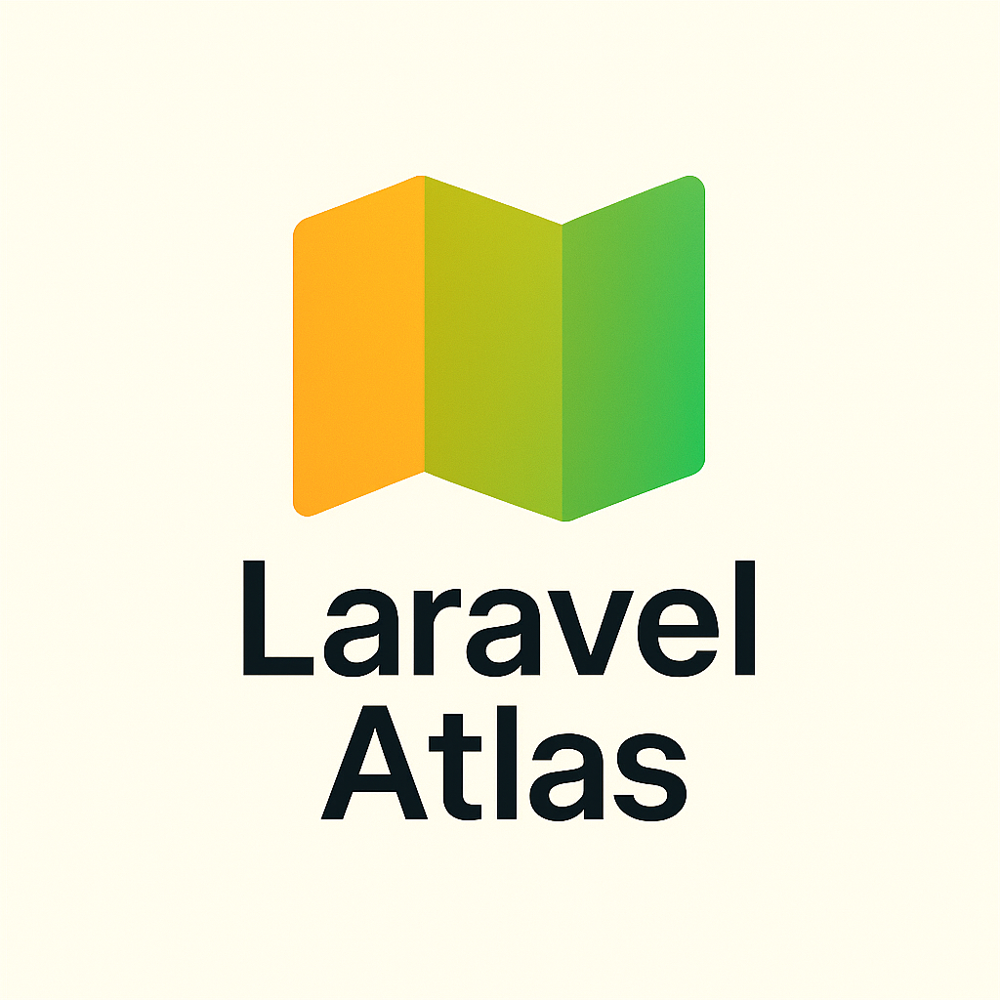

# Laravel Atlas



Advanced Laravel application mapping and visualization toolkit. Analyze, document, and visualize your Laravel project architecture with comprehensive dependency mapping and multiple export formats.

[](https://packagist.org/packages/grazulex/laravel-atlas)
[](https://packagist.org/packages/grazulex/laravel-atlas)
[](https://github.com/Grazulex/laravel-atlas/blob/main/LICENSE.md)
[](https://php.net/)
[](https://laravel.com/)
[](https://github.com/Grazulex/laravel-atlas/actions)
[](https://github.com/laravel/pint)

## 📖 Table of Contents

- [Overview](#overview)
- [✨ Features](#-features)
- [📦 Installation](#-installation)
- [🚀 Quick Start](#-quick-start)
- [🗺️ Architecture Mapping](#️-architecture-mapping)
- [📊 Export Formats](#-export-formats)
- [🔍 Analysis Tools](#-analysis-tools)
- [⚙️ Configuration](#️-configuration)
- [📚 Documentation](#-documentation)
- [💡 Examples](#-examples)
- [🧪 Testing](#-testing)
- [🔧 Requirements](#-requirements)
- [🚀 Performance](#-performance)
- [🤝 Contributing](#-contributing)
- [🔒 Security](#-security)
- [📄 License](#-license)

## Overview

Laravel Atlas is an advanced application mapping and visualization toolkit that scans your Laravel project to generate comprehensive architectural documentation. It analyzes models, services, routes, jobs, events, commands, and their interconnections, then exports visual representations in multiple formats.

**Perfect for code documentation, team onboarding, architecture reviews, and maintaining large enterprise applications.**

### 🎯 Use Cases

Laravel Atlas is perfect for:

- **Code Documentation** - Generate comprehensive application maps
- **Team Onboarding** - Visual architecture overviews for new developers
- **Architecture Reviews** - Analyze application structure and dependencies  
- **Legacy Code Analysis** - Understand complex existing applications
- **Compliance Reporting** - Generate architectural documentation

## ✨ Features

- 🚀 **Comprehensive Scanning** - Analyze models, services, routes, jobs, events, and more
- 🗺️ **Architecture Mapping** - Generate detailed application structure maps
- 📊 **Multiple Export Formats** - Export to Mermaid, Markdown, JSON, PDF, and HTML
- 🔍 **Dependency Analysis** - Track relationships and dependencies between components
- 📋 **Custom Node Types** - Extensible architecture for custom component types
- 🎯 **Smart Detection** - Intelligent component discovery and classification
- ✅ **Validation** - Validate architectural patterns and dependencies
- 📈 **Visual Diagrams** - Generate beautiful Mermaid diagrams and flowcharts
- 🧪 **Analysis Reports** - Comprehensive architectural analysis reports
- ⚡ **CLI Integration** - Powerful Artisan commands for map generation
- 🔄 **Real-time Updates** - Watch mode for continuous map updates
- 📝 **Documentation Generation** - Auto-generate architecture documentation

## 📦 Installation

Install the package via Composer:

```bash
composer require grazulex/laravel-atlas --dev
```

> **💡 Auto-Discovery**  
> The service provider will be automatically registered thanks to Laravel's package auto-discovery.

Publish configuration:

```bash
php artisan vendor:publish --tag=atlas-config
```

## 🚀 Quick Start

### 1. Generate Your First Map

```bash
php artisan atlas:generate
```

### 2. Generate Specific Component Maps

```bash
# Generate model architecture map
php artisan atlas:generate --type=models --format=mermaid

# Generate service layer map
php artisan atlas:generate --type=services --format=markdown

# Generate complete application map
php artisan atlas:generate --format=json --output=docs/architecture.json
```

### 3. Customize Export Formats

```bash
# Generate Mermaid diagram
php artisan atlas:generate --format=mermaid

# Generate comprehensive markdown documentation
php artisan atlas:generate --format=markdown --detailed

# Generate interactive HTML map
php artisan atlas:generate --format=html --interactive
```

### 4. Access Generated Maps

```php
use Grazulex\LaravelAtlas\Facades\Atlas;

// Get application architecture map
$map = Atlas::scan()->generate();

// Get specific component relationships
$modelRelations = Atlas::models()->analyze();

// Export to different formats
$mermaidDiagram = Atlas::export('mermaid');
$jsonData = Atlas::export('json');
$htmlMap = Atlas::export('html', ['interactive' => true]);
```

## 🗺️ Architecture Mapping

Laravel Atlas provides comprehensive architecture mapping capabilities:

```php
use Grazulex\LaravelAtlas\Mappers;

// Model architecture mapping
$modelMap = Mappers\ModelMapper::scan([
    'include_relationships' => true,
    'include_observers' => true,
    'include_factories' => true,
]);

// Service layer mapping
$serviceMap = Mappers\ServiceMapper::scan([
    'include_dependencies' => true,
    'include_interfaces' => true,
]);

// Route mapping
$routeMap = Mappers\RouteMapper::scan([
    'include_middleware' => true,
    'include_controllers' => true,
    'group_by_prefix' => true,
]);
```

## 📊 Export Formats

Multiple export formats for different use cases:

```bash
# Mermaid diagrams for documentation
php artisan atlas:export --format=mermaid --output=docs/architecture.mmd

# JSON for programmatic access
php artisan atlas:export --format=json --output=storage/atlas/map.json

# Markdown documentation
php artisan atlas:export --format=markdown --output=docs/ARCHITECTURE.md

# Interactive HTML maps
php artisan atlas:export --format=html --output=public/atlas/map.html

# PDF reports (planned)
php artisan atlas:export --format=pdf --output=reports/architecture.pdf
```

### Custom Export Templates

```php
// Register custom export template
Atlas::registerExporter('custom', function ($map, $options) {
    return new CustomExporter($map, $options);
});

// Use custom template
Atlas::export('custom', ['template' => 'enterprise']);
```

## 🔍 Analysis Tools

Comprehensive analysis and reporting tools:

```php
use Grazulex\LaravelAtlas\Analyzers;

// Dependency analysis
$dependencies = Analyzers\DependencyAnalyzer::analyze([
    'detect_circular' => true,
    'calculate_coupling' => true,
]);

// Architecture quality metrics
$metrics = Analyzers\QualityAnalyzer::analyze([
    'complexity_metrics' => true,
    'coupling_analysis' => true,
    'cohesion_analysis' => true,
]);

// Generate analysis report
$report = Atlas::analyze()->generateReport([
    'include_metrics' => true,
    'include_recommendations' => true,
    'format' => 'detailed',
]);
```

## ⚙️ Configuration

Laravel Atlas provides extensive configuration options:

```php
// config/atlas.php
return [
    'scan_paths' => [
        'models' => app_path('Models'),
        'services' => app_path('Services'),
        'jobs' => app_path('Jobs'),
        'events' => app_path('Events'),
    ],
    
    'export_formats' => [
        'mermaid' => ['theme' => 'default', 'direction' => 'TD'],
        'json' => ['pretty_print' => true, 'include_metadata' => true],
        'markdown' => ['include_toc' => true, 'detailed' => true],
    ],
    
    'analysis' => [
        'detect_patterns' => true,
        'calculate_metrics' => true,
        'include_suggestions' => true,
    ],
    
    'output' => [
        'path' => storage_path('atlas'),
        'filename_format' => '{type}_{date}',
    ],
];
```

## 📚 Documentation

For detailed documentation, examples, and advanced usage:

- 📚 [Full Documentation](docs/README.md)
- 🎯 [Examples](examples/README.md)
- 🔧 [Configuration](docs/configuration.md)
- 🧪 [Testing](docs/testing.md)
- 🗺️ [Architecture Mapping](docs/mapping.md)

## 💡 Examples

### Generate Complete Application Map

```bash
# Generate comprehensive application architecture
php artisan atlas:generate --all --format=mermaid --output=docs/

# Generate specific component maps
php artisan atlas:models --with-relationships
php artisan atlas:services --with-dependencies
php artisan atlas:routes --group-by-middleware
```

### Custom Architecture Analysis

```php
use Grazulex\LaravelAtlas\Facades\Atlas;

// Custom analysis workflow
$analysis = Atlas::scan(['app/Models', 'app/Services'])
    ->analyze(['dependencies', 'patterns', 'metrics'])
    ->export('markdown', [
        'include_diagrams' => true,
        'include_metrics' => true,
        'detailed_analysis' => true,
    ]);

file_put_contents('docs/architecture-analysis.md', $analysis);
```

### Interactive Architecture Explorer

```php
// Generate interactive HTML map
Atlas::generate([
    'format' => 'html',
    'interactive' => true,
    'include_search' => true,
    'include_filters' => true,
    'theme' => 'dark',
])->save('public/atlas/explorer.html');
```

### CI/CD Integration

```bash
# In your CI/CD pipeline
php artisan atlas:generate --format=json --validate-architecture
php artisan atlas:compare --baseline=storage/atlas/baseline.json --current
```

Check out the [examples directory](examples) for more examples.

## 🧪 Testing

Laravel Atlas includes comprehensive testing utilities:

```php
use Grazulex\LaravelAtlas\Testing\AtlasTester;

public function test_application_architecture()
{
    AtlasTester::make()
        ->scanApplication()
        ->assertComponentExists('User', 'model')
        ->assertRelationshipExists('User', 'Posts', 'hasMany')
        ->assertServiceExists('UserService')
        ->assertMapGeneratesSuccessfully();
}

public function test_architecture_quality()
{
    AtlasTester::make()
        ->analyzeArchitecture()
        ->assertNoCyclicDependencies()
        ->assertCouplingBelow(0.8)
        ->assertCohesionAbove(0.6);
}
```

## 🔧 Requirements

- PHP: ^8.3
- Laravel: ^12.0
- Carbon: ^3.10

## 🚀 Performance

Laravel Atlas is optimized for performance:

- **Efficient Scanning**: Optimized file system scanning and parsing
- **Smart Caching**: Intelligent caching of analysis results
- **Memory Management**: Efficient memory usage for large applications
- **Incremental Updates**: Only scan changed files when possible

## 🤝 Contributing

We welcome contributions! Please see our [Contributing Guide](CONTRIBUTING.md) for details.

## 🔒 Security

If you discover a security vulnerability, please review our [Security Policy](SECURITY.md) before disclosing it.

## 📄 License

Laravel Atlas is open-sourced software licensed under the [MIT license](LICENSE.md).

---

**Made with ❤️ for the Laravel community**

### Resources

- [📖 Documentation](docs/README.md)
- [💬 Discussions](https://github.com/Grazulex/laravel-atlas/discussions)
- [🐛 Issue Tracker](https://github.com/Grazulex/laravel-atlas/issues)
- [📦 Packagist](https://packagist.org/packages/grazulex/laravel-atlas)

### Community Links

- [CODE_OF_CONDUCT.md](CODE_OF_CONDUCT.md) - Our code of conduct
- [CONTRIBUTING.md](CONTRIBUTING.md) - How to contribute
- [SECURITY.md](SECURITY.md) - Security policy
- [RELEASES.md](RELEASES.md) - Release notes and changelog
